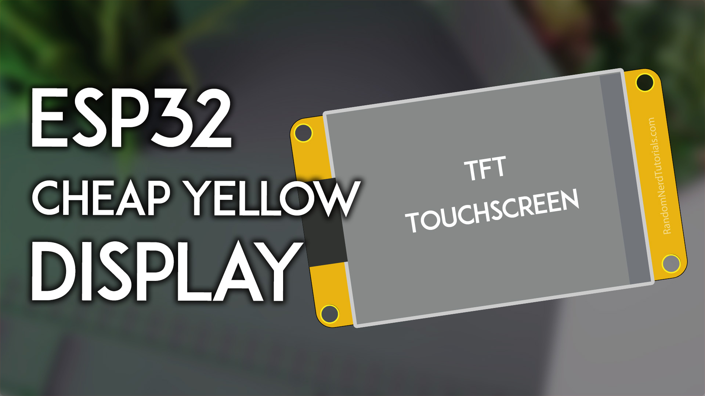
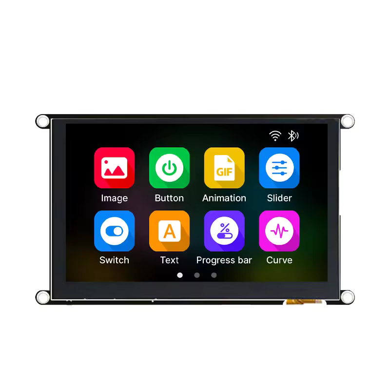

# 支持的板子

| 板型 | 构建目标 | 屏幕 | 触摸 | 主控 / Flash | 状态 |
|---|---|---|---|---|---|
| [CYD 2432S028R](#cyd-2432s028r) | `cyd_2432s028r` | 2.8" 240×320 ILI9341 SPI | XPT2046 电阻 | ESP32 / 4MB | ✅ 稳定 |
| [E32R35T](#e32r35t) | `e32r35t` | 3.5" 320×480 ST7796U SPI | XPT2046 电阻 | ESP32-32E / 4MB | ✅ 稳定 |
| [JC8048W550](#jc8048w550) | `jc8048w550` | 5" 800×480 ST7262 RGB 并口 | GT911 电容 | ESP32-S3 / 16MB | ✅ 稳定 |

刷机包命名：`klipper-remote-esp32-<board>.zip`（资产名不带版本号，下面的直链永远指向最新正式版）。遇到问题请到 [Issues](https://github.com/umeiko/KlipperScreen-esp/issues) 反馈。

| 板型 | 刷机包直链（最新正式版） |
|---|---|
| CYD 2432S028R | [klipper-remote-esp32-cyd_2432s028r.zip](https://github.com/umeiko/KlipperScreen-esp/releases/latest/download/klipper-remote-esp32-cyd_2432s028r.zip) |
| E32R35T | [klipper-remote-esp32-e32r35t.zip](https://github.com/umeiko/KlipperScreen-esp/releases/latest/download/klipper-remote-esp32-e32r35t.zip) |
| JC8048W550 | [klipper-remote-esp32-jc8048w550.zip](https://github.com/umeiko/KlipperScreen-esp/releases/latest/download/klipper-remote-esp32-jc8048w550.zip) |
| Windows 桌面模拟器 | [klipper-remote-desktop-win-x86_64.zip](https://github.com/umeiko/KlipperScreen-esp/releases/latest/download/klipper-remote-desktop-win-x86_64.zip) |

---

## CYD 2432S028R

*"Cheap Yellow Display"（黄色 PCB 的 2.8" 开发板），本项目的参考板型。* 图：[Random Nerd Tutorials](https://randomnerdtutorials.com/cheap-yellow-display-esp32-2432s028r/)

逻辑分辨率 **320×240 横屏**。

- 主控：ESP32（双核 240MHz，520KB SRAM），4MB QIO Flash
- 显示：ILI9341，SPI2 @ 40MHz，DMA 双缓冲（2 × 40 行）
- 触摸：XPT2046 电阻屏，**独立 SPI3 总线**（实测与 LCD 共享总线时 MISO 无应答）；出厂触摸校准已内置
- 背光：GPIO21，LEDC PWM 8bit/5kHz，高电平点亮

| 功能 | GPIO | 备注 |
|---|---|---|
| LCD SCLK / MOSI / MISO | 14 / 13 / 12 | SPI2 |
| LCD CS / DC / RST | 15 / 2 / 4 | |
| LCD 背光 | 21 | LEDC PWM |
| 触摸 SCLK / MOSI / MISO | 25 / 32 / 39 | SPI3，与 LCD 不同总线 |
| 触摸 CS / IRQ | 33 / 36 | |

## E32R35T

*ESP32-32E 3.5" 显示模组（[lcdwiki 资料页](https://www.lcdwiki.com/zh/3.5inch_ESP32-32E_Display)，触摸版 SKU：E32R35T）。* 图：lcdwiki

逻辑分辨率 **480×320 横屏**。

- 主控：ESP32-WROOM-32E（双核 240MHz），4MB QIO Flash
- 显示：ST7796U，SPI2 @ 40MHz；**与触摸屏共用 SPI 总线**（厂商设计）；无独立 RST（与 ESP32 EN 共用，驱动走软件复位）
- 触摸：XPT2046 电阻屏，共用 SPI2；出厂触摸校准已内置（提取自真机，免校准；个体差异可用串口 CLI `caltouch` 重校）
- 背光：GPIO27，高电平点亮

| 功能 | GPIO | 备注 |
|---|---|---|
| LCD+触摸 SCLK / MOSI / MISO | 14 / 13 / 12 | SPI2，两设备共用 |
| LCD CS / DC | 15 / 2 | |
| LCD RST | — | 与 EN 共用 |
| LCD 背光 | 27 | LEDC PWM |
| 触摸 CS / IRQ | 33 / 36 | XPT2046 |
| RGB 三色灯 R / G / B | 22 / 16 / 17 | 共阳极，低电平点亮（固件未使用） |
| MicroSD CS / MOSI / SCLK / MISO | 5 / 23 / 18 / 19 | 独立 SPI 组（固件未使用） |
| 音频使能 / DAC 输出 | 4 / 26 | 喇叭接口（固件未使用） |
| 电池电压 ADC | 34 | 输入 |
| BOOT 按键 | 0 | |

## JC8048W550

*Guition 5" 电容屏模组（ESP32-S3）。* 图：[openHASP 硬件页](https://www.openhasp.com/0.7.0/hardware/guition/jc8048w550/)

逻辑分辨率 **800×480**。RGB 并口屏的撕裂/抽动排障全过程见[开发笔记](jc8048w550-rgb-display-guide.md)。

- 主控：ESP32-S3，16MB Flash + PSRAM（双帧缓冲 2×768KB 放在 PSRAM）
- 显示：ST7262 RGB 并口（RGB565），PCLK **必须 16MHz**；自研 rgb44 驱动（IDF 4.4 传输模型 + vsync 换页）
- 触摸：GT911 电容屏，I2C0，轮询无 INT，无需校准
- 背光：GPIO2，高电平点亮，80–100% 区间有硬件曲线补偿

| 功能 | GPIO |
|---|---|
| LCD DE / VSYNC / HSYNC / PCLK | 40 / 41 / 39 / 42 |
| LCD B0..B4 | 8, 3, 46, 9, 1 |
| LCD G0..G5 | 5, 6, 7, 15, 16, 4 |
| LCD R0..R4 | 45, 48, 47, 21, 14 |
| LCD 背光 | 2 |
| 触摸 SDA / SCL / RST | 19 / 20 / 38 |
